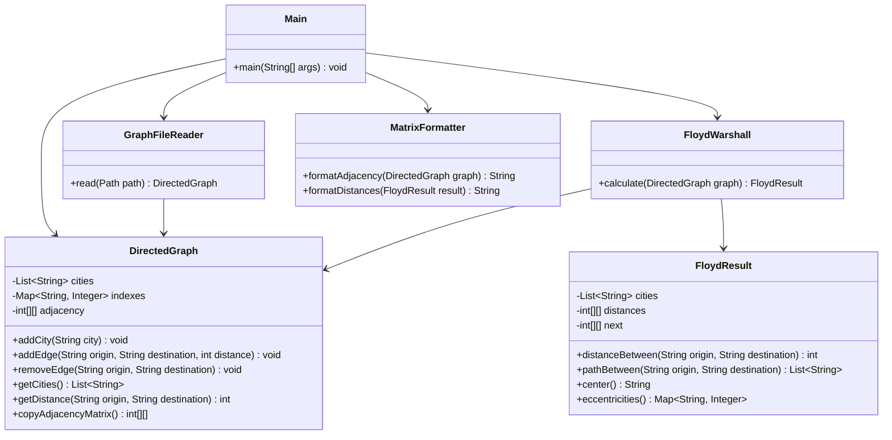

# Diagrama UML

```mermaid
classDiagram
    class Main {
        +main(String[] args) void
    }

    class DirectedGraph {
        -List~String~ cities
        -Map~String, Integer~ indexes
        -int[][] adjacency
        +addCity(String city) void
        +addEdge(String origin, String destination, int distance) void
        +removeEdge(String origin, String destination) void
        +getCities() List~String~
        +getDistance(String origin, String destination) int
        +copyAdjacencyMatrix() int[][]
    }

    class GraphFileReader {
        +read(Path path) DirectedGraph
    }

    class FloydWarshall {
        +calculate(DirectedGraph graph) FloydResult
    }

    class FloydResult {
        -List~String~ cities
        -int[][] distances
        -int[][] next
        +distanceBetween(String origin, String destination) int
        +pathBetween(String origin, String destination) List~String~
        +center() String
        +eccentricities() Map~String, Integer~
    }

    class MatrixFormatter {
        +formatAdjacency(DirectedGraph graph) String
        +formatDistances(FloydResult result) String
    }

    Main --> GraphFileReader
    Main --> DirectedGraph
    Main --> FloydWarshall
    Main --> MatrixFormatter
    GraphFileReader --> DirectedGraph
    FloydWarshall --> DirectedGraph
    FloydWarshall --> FloydResult
```

